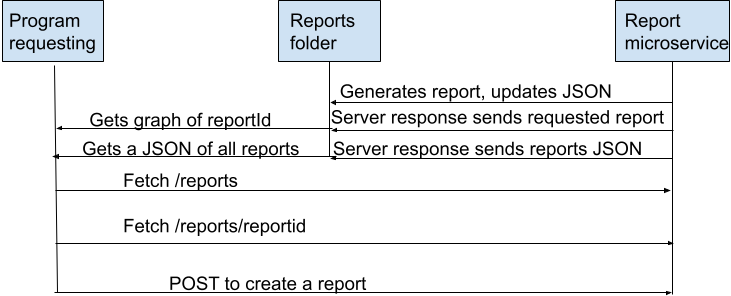

In order to use the reporting-microservice, you must navigate to the directory you have it stored in a terminal and run "npm install". Once all of the node_modules are downloaded, you can actually run the API buy navigating in a terminal to where you have reporting-microservice saved and running "node reporting-microservice.js". On start up a new report json will be made if one doesn't already exist but if reports already exist with no JSON there may be issues so avoid this.

If you would like to make a different style of report, add to const chartTypes in reporting-microservice.js. The format is 'name-of-report' : 'chart-style'.

To REQUEST from reporting-microservice, you will be creating a new report: Use a fetch to 'http://localhost:5000/reports/generate'. This fetch should be a POST with content type 'application/json' and should have a body which contains reportType, a title, categories for your chart, and what values each respective category has.
Example (JavaScript): 
const response = await fetch('http://localhost:5000/reports/generate', {
    method: 'POST',
    headers: { 'Content-Type': 'application/json' },
    body: JSON.stringify({
        reportType: 'revenue-vs-expenses',
        title: 'Revenue Vs Expenses',
        categories: ['Ticket Sales', 'Sponsorships', 'Expenses'],
        values: [10000, 6000, 7000]
    })
});
const data = await response.json();

There are a few options if you would like to RECIEVE data from reporting-microservice

Recieve a specific report (gives you the actual png): You must make a fetch to 'http://localhost:5000/reports/reportId' for the desired report id. 
Example (JavaScript):
const response = await fetch(`http://localhost:5000/reports/${reportId}`);  // Assuming you have a variable reportId to store your desired report id

Recieve all reports (gives a JSON of all reports): Make a fetch to 'http://localhost:5000/reports'.
Example (JavaScript): 
const response = await fetch('http://localhost:5000/reports');
const data = await response.json();  // You can now use data as you would any variable to output to console or a front end

